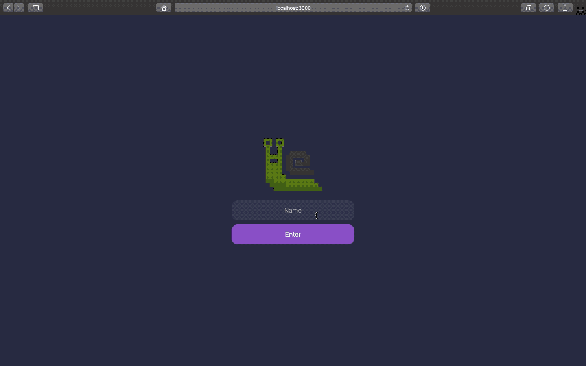

<h1 align="center">Task Management</h1>

## Prints
<p align="center">
  
</p>

## Objectives and Challanges
The first of all challenges is to build a design without any specifications or helpful assets (as the backgrounds used), only a picture with the final result.

Secondly as a personal challenge I decided to implement one new design element and some animations during the user interactions, the new element added was the input to add a new task in the list; The animation to show and hide the input, animations to show elements and this one combined the state when it was been updated.

Thirdly, I decided to add a new screen only to add screen transition and test some animations during this process, this was the first time that I tried to change the screen using an animation to remove the "old screen" and show the "new".

To conclude, it was a simple project with basic and medium front end features made to learn more the limits and possibilities of react.js interacting with css and to improve my knowledge about front end development applying it.

## Packages
 - `react-icons` to provide all icons used.
 - `eslint`, only for development, to define the code patterns as quotes, white spaces, etc.


## How to use

To clone and run this application, you'll need [Git](https://git-scm.com/downloads) and [React](https://reactjs.org/) installed on your computer. From your command line:

```
# Clone this repository
$ git clone https://github.com/feMoraes0/task-management-ui.git

# Go into the repository
$ cd task-management-ui

# Install dependencies
$ npm install

# Run the app
$ npm start
```

## Credits
 - [#Exploration - Dashboard for Task Management by Dwinawan](https://dribbble.com/shots/6816310--Exploration-Dashboard-for-Task-Management/attachments)

## Contact
  - <a target="_blank" href="https://www.linkedin.com/in/fernando-moraes-48a26916a/">LinkedIn</a>
  - <a target="_blank" href="mailto:fernandomoraes.lopes@gmail.com">E-mail</a>